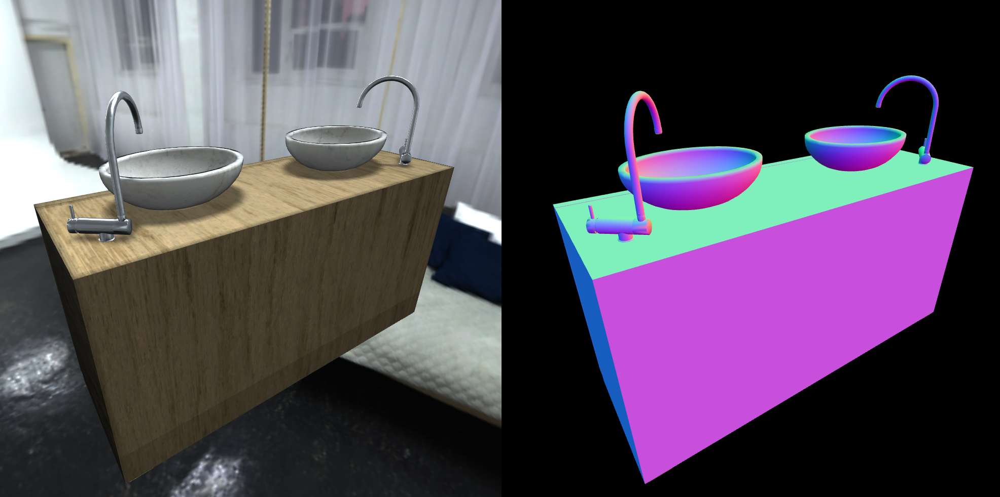

# Renderer

### Overview

We developed our own MeshRenderer that supports customizable camera configuration and various image modalities, and renders at a lightening speed. Specifically, you can specify image width, height and vertical field of view in the constructor of `class MeshRenderer`. Then you can call `renderer.render(modes=('rgb', 'normal', 'seg', '3d', 'optical_flow', 'scene_flow'))` to retrieve the images. Currently we support six different image modalities: RGB, surface normal, segmentation, 3D point cloud (z-channel can be extracted as depth map), optical flow, and scene flow. We also support two types of LiDAR sensors: 1-beam and 16-beam (like Velodyne VLP-16). Most of the code can be found in [igibson/render](https://github.com/StanfordVL/iGibson/tree/master/igibson/render).

### Examples

#### Simple Example

In this example, we render an iGibson scene with a few lines of code. The code can be found in [igibson/examples/demo/mesh_renderer_simple_example.py](https://github.com/StanfordVL/iGibson/blob/master/igibson/examples/demo/mesh_renderer_simple_example.py).

```
import cv2
import sys
import os
import numpy as np
from igibson.render.mesh_renderer.mesh_renderer_cpu import MeshRenderer
from igibson.utils.assets_utils import get_scene_path


def main():
    if len(sys.argv) > 1:
        model_path = sys.argv[1]
    else:
        model_path = os.path.join(get_scene_path('Rs'), 'mesh_z_up.obj')

    renderer = MeshRenderer(width=512, height=512)
    renderer.load_object(model_path)
    renderer.add_instance(0)
    camera_pose = np.array([0, 0, 1.2])
    view_direction = np.array([1, 0, 0])
    renderer.set_camera(camera_pose, camera_pose + view_direction, [0, 0, 1])
    renderer.set_fov(90)
    frames = renderer.render(
        modes=('rgb', 'normal', '3d'))
    frames = cv2.cvtColor(np.concatenate(frames, axis=1), cv2.COLOR_RGB2BGR)
    cv2.imshow('image', frames)
    cv2.waitKey(0)


if __name__ == '__main__':
    main()
```

For `Rs` scene, the rendering results will look like this:


#### Interactive Example

In this example, we show an interactive demo of MeshRenderer.

```bash
python -m igibson.examples.demo.mesh_renderer_example
```
You may translate the camera by pressing "WASD" on your keyboard and rotate the camera by dragging your mouse. Press `Q` to exit the rendering loop. The code can be found in [igibson/examples/demo/mesh_renderer_example.py](https://github.com/StanfordVL/iGibson/blob/master/igibson/examples/demo/mesh_renderer_example.py).

#### PBR (Physics-Based Rendering) Example

You can test the physically based renderer with the PBR demo. You can render any objects included in iG dataset, here
 we show a sink for example, as it includes different materials. You need to pass in a folder, since it will load all
  obj files in the folder.

```bash
python -m igibson.examples.demo.mesh_renderer_example_pbr <path to ig_dataset>/objects/sink/sink_1/shape/visual
```


You will get a nice rendering of the sink, and should see the metal parts have specular highlgihts, and shadows
 should be casted. 
 

#### Velodyne VLP-16 Example
In this example, we show a demo of 16-beam Velodyne VLP-16 LiDAR placed on top of a virtual Turtlebot. The code can be found in [igibson/examples/demo/lidar_velodyne_example.py](https://github.com/StanfordVL/iGibson/blob/master/igibson/examples/demo/lidar_velodyne_example.py).

The Velodyne VLP-16 LiDAR visualization will look like this:


#### Render to PyTorch Tensors

In this example, we show that MeshRenderer can directly render into a PyTorch tensor to maximize efficiency. PyTorch installation is required (otherwise, iGibson does not depend on PyTorch). The code can be found in [igibson/examples/demo/mesh_renderer_gpu_example.py](https://github.com/StanfordVL/iGibson/blob/master/igibson/examples/demo/mesh_renderer_gpu_example.py).


#### About the 3D Image

The mode '3d' provides a 4-channeled image where the first three channels correspond to the x, y, and z coordinates of the pixels in the image. Because our code internally uses OpenGL for rendering, the coordinates are defined in the common convention of this framework: for a given image, the x axis point left to right, the y axis point bottom to top, and the z axis points from front to the backward, in the opposite direction to the viewing direction of the camera. The camera is located at the location of the frame "eyes" of the robot, but the orientation of this frame corresponds to the computer vision convention: x axis pointing forward in the viewing direction of the camera, y axis pointing right to left and z axis pointing bottom to top. The following code can be helpful to transform between reference frames:

```
# Pose of the camera of the simulated robot in world frame
eye_pos, eye_orn = self.robot.parts["eyes"].get_position_orientation()
camera_in_wf = quat2rotmat(xyzw2wxyz(eye_orn))
camera_in_wf[:3,3] = eye_pos

# Transforming coordinates of points from opengl frame to camera frame
camera_in_openglf = quat2rotmat(euler2quat(np.pi / 2.0, 0, -np.pi / 2.0))

# Pose of the simulated robot in world frame
robot_pos, robot_orn = self.robot.get_position_orientation()
robot_in_wf = quat2rotmat(xyzw2wxyz(robot_orn))
robot_in_wf[:3, 3] = robot_pos

u = 0
v = 0
[td_image] = self.env.simulator.renderer.render(modes=('3d'))
point_in_openglf = td_image[u,v]
point_in_cf = np.dot(camera_in_openglf, point_in_openglf)
point_in_rf = np.dot(cam_in_robot_frame, point_in_cf)
point_in_wf = np.dot(robot_in_wf, point_in_rf)
```

#### About the Semantic Segmentation Image

The mode 'seg' provides a 4-channeled image where the first channel corresponds to the semantic segmentation. The values are normalized between 0 and 1, with a normalizing constant of `MAX_CLASS_COUNT = 512` (defined in `utils/constants.py`). The following code is helpful to unnormalize the segmentation image:

```
[segmentation] = self.env.simulator.renderer.render(modes=('seg'))
seg = (segmentation[:, :, 0:1] * MAX_CLASS_COUNT).astype(np.int32)
```
This transformation is directly performed if the segmentation is accessed through a `VisionSensor` (e.g., as part of the iGibsonEnv) using the method `get_seg`.
